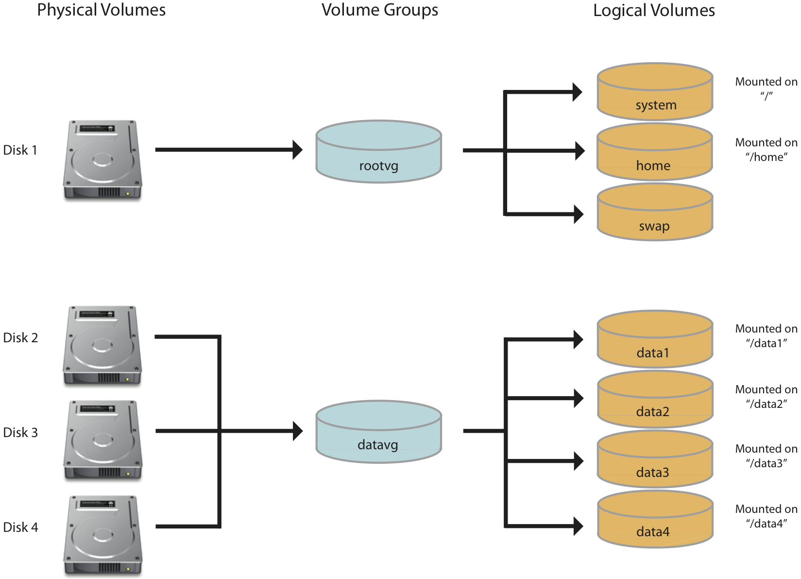
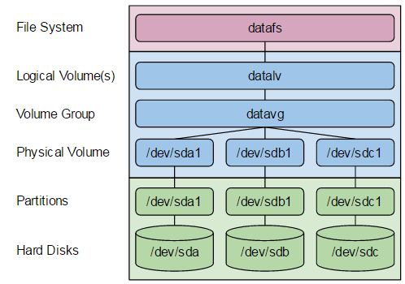

## Logical Volume Management (LVM)
Device mapper framework that provides logical volume management for the Linux kernel. Most modern Linux distributions are LVM-aware to the point of being able to have their root file systems on a logical volume.

Uses:
1. Creating single logical volumes of multiple physical volumes or entire hard disks (somewhat similar to RAID 0, but more similar to JBOD), allowing for dynamic volume resizing.
2. Managing large hard disk farms by allowing disks to be added and replaced without downtime or service disruption, in combination with hot swapping.
3. On small systems (like a desktop), instead of having to estimate at installation time how big a partition might need to be, LVM allows file systems to be easily resized as needed.
4. Performing consistent backups by taking snapshots of the logical volumes.
5. Encrypting multiple physical partitions with one password.

LVM can be considered as a thin software layer on top of the hard disks and partitions, which creates an abstraction of continuity and ease-of-use for managing hard drive replacement, repartitioning and backup.

<!-- https://aws.amazon.com/premiumsupport/knowledge-center/create-lv-on-ebs-volume/ -->

## Add Disk and Create New LVM Partition (pvcreate, vgcreate, ivcreate)
1. pvcreate: a physical volume from the partition 
2. vgcreate: Create volume groups and add the physical volumes into the volume group
3. lvcreate: Create a logical volume (LV) and a mount directory

<!-- https://aws.amazon.com/premiumsupport/knowledge-center/create-lv-on-ebs-partition/ -->

## LVM manager (Stratis)
Easy to use local storage management for Linux.

Stratis is a tool to easily configure pools and filesystems with enhanced storage functionality that works within the existing Linux storage management stack. To achieve this, Stratis prioritizes a straightforward command-line experience, a rich API, and a fully automated approach to storage management. It builds upon elements of the existing storage stack as much as possible. Specifically, Stratis uses device-mapper, LUKS, XFS, and Clevis. Stratis may also incorporate additional technologies in the future.

Stratis can configure an encrypted or unencrypted pool of storage with one or more file systems quickly and without prior knowledge of the many storage layers and commands.